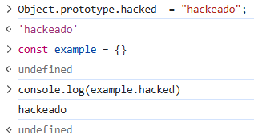
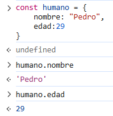
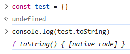
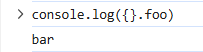
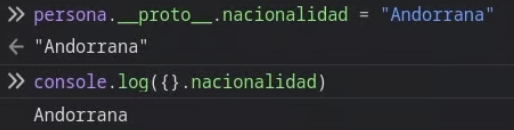
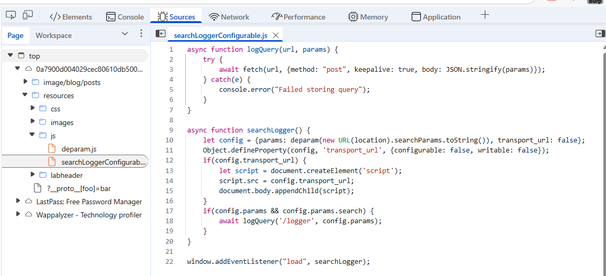
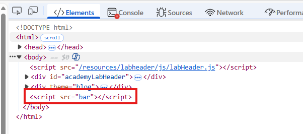
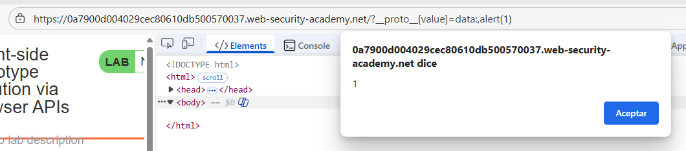

# 🧪 Prototype pollution en el lado cliente usando APIs del navegador

## 📄 Descripción del laboratorio

Este laboratorio es vulnerable a DOM XSS mediante la contaminación del prototipo del lado del cliente. Los desarrolladores del sitio web han notado un posible gadget e intentaron parchearlo. Sin embargo, puedes eludir las medidas que han tomado.

Para resolver el laboratorio:

Encuentra una fuente que puedas usar para agregar propiedades arbitrarias al Object.prototype global.

Identifica una propiedad gadget que te permita ejecutar JavaScript arbitrario.

Combina estos elementos para llamar a alert().

Puedes resolver este laboratorio manualmente en tu navegador o usar DOM Invader para ayudarte.

Este laboratorio se basa en vulnerabilidades del mundo real descubiertas por PortSwigger Research. Para más detalles, consulta Widespread prototype pollution gadgets de Gareth Heyes.


## 📚 Teoría

En esta primera parte del laboratorio nos centramos en descubrir si la aplicación es vulnerable a prototype pollution del lado cliente. Analizamos cómo es posible modificar el objeto global ‘**Object.prototype**‘ inyectando propiedades a través del query string, verificando la manipulación en la consola del navegador.

Este tipo de inyecciones nos permite alterar el comportamiento de objetos en toda la aplicación. Además, exploramos los archivos JavaScript para detectar posibles gadgets que podrían usarse como sinks, sentando así las bases para una explotación más avanzada en la segunda parte.

Este enfoque nos introduce a una técnica moderna y poderosa que afecta directamente al DOM desde el navegador.


## 📝 Práctica

Todos los objetos en JavaScript heredan propiedades de **Object.prototype**. Si un atacante logra modificar este prototipo base, la modificación afectará a todos los objetos del entorno.

<br>

En el ejemplo podemos observar cómo se hereda la propiedad **hacked** con su correspondiente valor.

Un objeto en JavaScript no es más que una colección de pares clave-valor.

<br>

El objeto mostrado posee propiedades propias: **nombre** y **edad**.

Cuando se intenta acceder a una propiedad que no existe como propia en el objeto, JavaScript continúa la búsqueda en la cadena de prototipos.

El objeto **test** no define la propiedad **toString**, pero la hereda directamente de **Object.prototype**.

<br>

El riesgo aparece cuando un atacante consigue inyectar propiedades en el prototipo que alteren el comportamiento normal de la aplicación.

Lo primero es comprobar si es posible contaminar el prototipo.

Para ello introducimos la siguiente sintaxis en la URL.

```
https://0a7900d004029cec80610db500570037.web-security-academy.net/?__proto__[foo]=bar
```

Una vez hecho, al inspeccionar en consola la propiedad **foo** de un objeto vacío, obtenemos como resultado **bar**. Esto confirma que el prototipo ha sido contaminado exitosamente.

<br>

Hemos logrado incorporar una nueva propiedad que estará disponible en todos los objetos.

La clave mágica **proto** permite añadir propiedades a nivel global en todos los objetos (cuando el contexto lo permite).

<br>

Ahora pasamos al concepto de **gadget**: fragmento de código JavaScript existente en la aplicación que opera sobre una propiedad controlable por el atacante mediante contaminación del prototipo.

Tras navegar por el depurador, localizamos el siguiente código.

<br>

Se crea un objeto **config** con varias propiedades, entre ellas **transport\_url** inicializada en **false**.

Posteriormente, esta misma propiedad se redefine sin asignarle valor, por lo que **transport\_url** pasa a ser **undefined**.

Nuestro objetivo será contaminar el prototipo para que el objeto **config** herede un valor truthy en **transport\_url** y así ejecutar el bloque condicional del if.

Este patrón de funcionamiento es extremadamente común en aplicaciones reales.

Por ello, procedemos a contaminar la propiedad **value** a nivel de prototipo.

<br>

Como resultado, observamos que el atributo **src** del elemento ha sido modificado correctamente.

<br>

Finalmente, para materializar un XSS aprovechando este gadget, basta con utilizar la siguiente sintaxis.

<br>

Laboratorio resuelto:


