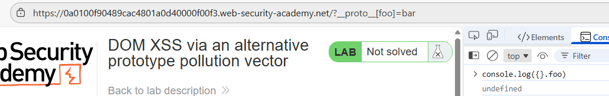
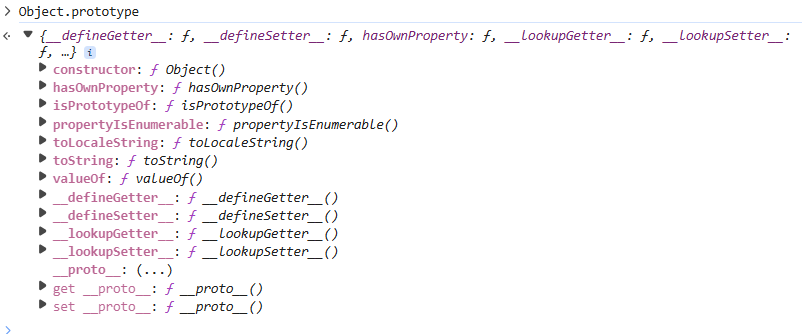
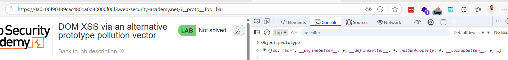
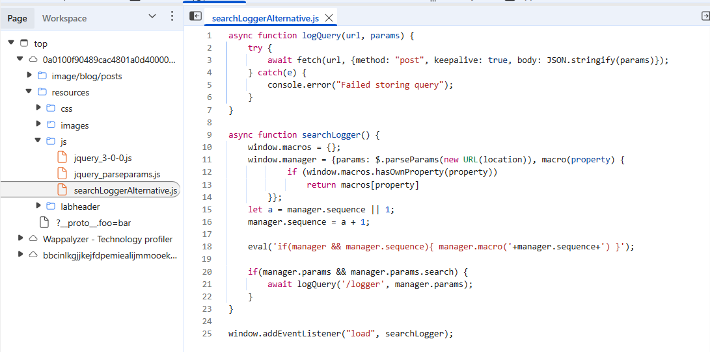
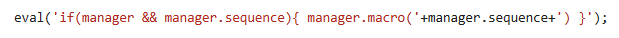
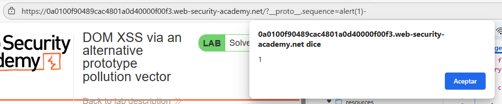

# 🧪 XSS en el DOM con vector alternativo de pollution

## 📄 Descripción del laboratorio

Este laboratorio es vulnerable a XSS DOM a través de la contaminación de prototipos del lado del cliente. Para resolver el laboratorio:

Encuentra una fuente que puedas usar para añadir propiedades arbitrarias al Object.prototype global.

Identifica una propiedad gadget que te permita ejecutar JavaScript arbitrario.

Combina estos para llamar a alert().

Puedes resolver este laboratorio manualmente en tu navegador, o usar DOM Invader para ayudarte.

## 📚 Teoria

En esta clase trabajamos con una variante de client-side prototype pollution en la que el vector tradicional ‘**proto\[propiedad]=valor**‘ no funciona, pero conseguimos el mismo efecto usando la sintaxis alternativa ‘**proto.propiedad=valor**‘.

Al modificar directamente ‘**Object.prototype**‘ de esta forma, inyectamos propiedades que serán heredadas por objetos posteriores. Analizando el código en ‘**searchLoggerAlternative.js**‘ encontramos un sink en la función **eval**, que utiliza el valor de ‘**manager.sequence**‘. Esta propiedad no existe por defecto, por lo que podemos controlarla a través de la contaminación del prototipo. Inicialmente el payload no se ejecuta debido a un carácter adicional que rompe la sintaxis, pero al añadir un guion al final del valor solucionamos el error y logramos ejecutar ‘**alert(1)**‘, resolviendo el laboratorio.

Esta clase muestra cómo pequeñas variaciones en los vectores de ataque pueden ser clave para explotar con éxito una vulnerabilidad.

## 📝 Práctica

Vamos a verificar si es posible alterar el prototipo mediante contaminación.

Inyectamos el payload clásico con **proto**\[foo]=bar y comprobamos en consola si un objeto vacío hereda la propiedad foo.&#x20;

 

El resultado es negativo: no aparece ninguna propiedad foo, lo que indica que esta técnica de contaminación no está funcionando en el contexto actual.

 

Probamos entonces una forma alternativa de contaminación del prototipo.&#x20;

 

En esta ocasión la inyección tiene éxito y la propiedad se refleja correctamente en la cadena de prototipos.

Con la contaminación confirmada, procedemos a buscar el gadget explotable, como es habitual en este tipo de vulnerabilidades. Abrimos el depurador y localizamos un script interesante que analizamos en detalle.

 

De forma inmediata destaca la presencia de una llamada a eval(), un punto crítico de altísima severidad por el riesgo de ejecución de código JavaScript arbitrario si logramos controlar su entrada.

 

Dentro del código observamos un objeto llamado manager que debería tener una propiedad sequence, pero esta no está definida de forma propia en el objeto.

Nuestro objetivo pasa a ser alterar (contaminar) esa propiedad sequence a través del prototipo para inyectar un valor bajo nuestro control.

Notamos que la lógica interna parece estar tomando o esperando un valor numérico positivo para sequence, posiblemente incrementándolo o validándolo a partir de 1. Por ello, inyectamos deliberadamente un valor negativo en la propiedad sequence mediante la contaminación del prototipo, lo que permite romper las asunciones del código y alterar el comportamiento esperado de la aplicación.

 

Laboratorio resuelto:

