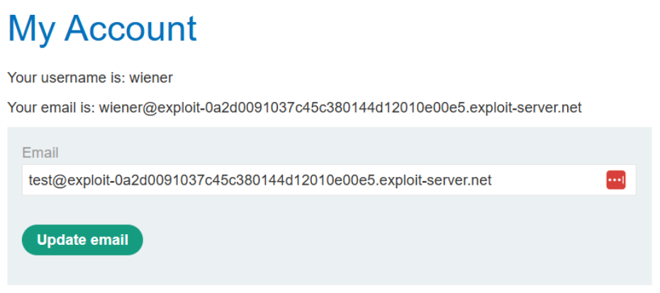
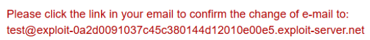
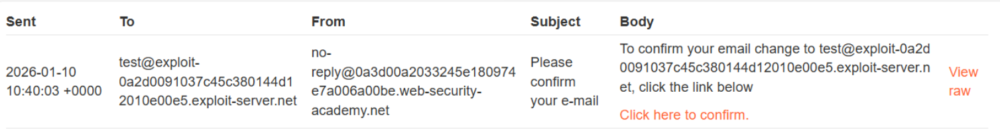
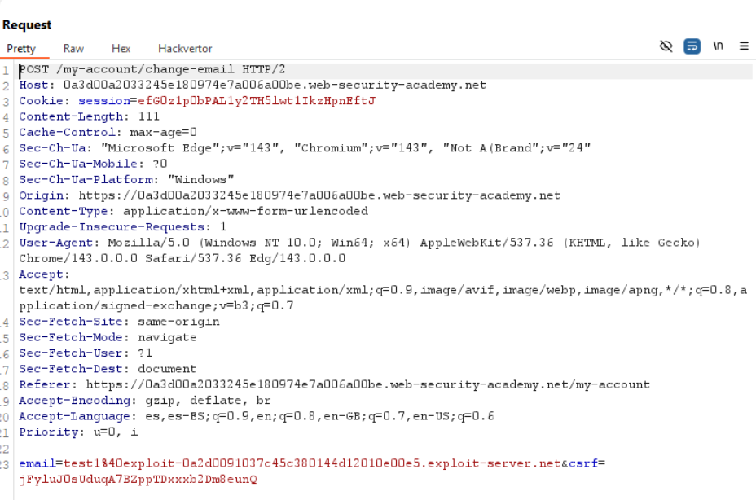
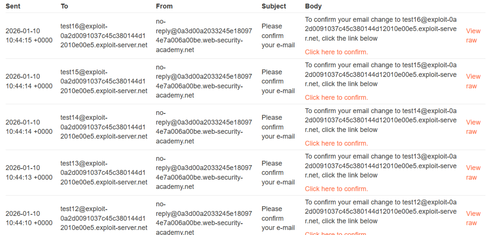
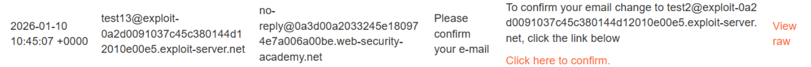
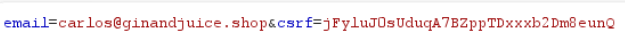
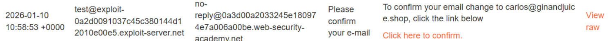
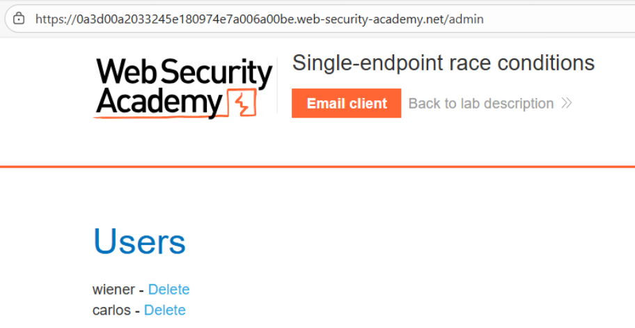

# 🧨 Condición de carrera en cambio de email (single endpoint)

## 📄 Descripción del laboratorio

La funcionalidad de cambio de correo electrónico contiene una **condición de carrera en un único endpoint**, lo que permite asociar direcciones de correo arbitrarias a nuestra cuenta.

Existe una dirección especial:

```
carlos@ginandjuice.shop
```

Esta dirección tiene una invitación pendiente para administrador, pero el usuario **carlos** aún no ha creado la cuenta.

El objetivo es:

* Explotar la race condition
* Asociar ese correo a nuestra cuenta
* Obtener privilegios de administrador
* Acceder a `/admin`
* Eliminar al usuario carlos

Credenciales:

```
wiener:peter
```


## 📚 Teoría

Este laboratorio explota una **race condition dentro de un único endpoint**, no entre múltiples endpoints.

### 📌 Flujo esperado

1. El usuario solicita un cambio de email
2. El servidor guarda el email como pendiente
3. Genera un token de confirmación
4. Envía el email de confirmación
5. El usuario confirma el cambio

### 📌 El fallo

Los pasos **2, 3 y 4 no son atómicos** ni están protegidos.

Si enviamos múltiples peticiones simultáneamente:

* Una petición establece un email
* Otra modifica ese email antes de enviar el mensaje
* El servidor mezcla estados inconsistentes

Resultado:

* El token corresponde a un email
* Pero el correo se envía a otro

Esto permite:

* Generar un enlace válido para `carlos@ginandjuice.shop`
* Recibirlo en nuestro correo
* Confirmarlo nosotros
* Obtener privilegios de administrador


## 📝 Práctica

### 1️⃣ Reconocimiento inicial

Iniciamos sesión con:

```
wiener:peter
```

Accedemos a **My account** y comprobamos:

* Podemos cambiar el email libremente
* Se envía un email de confirmación

<br>

Podemos ver los correos en el **Email client del laboratorio**.

Confirmamos el flujo:

```
cambio de email → envío de confirmación
```

<br>




### 2️⃣ Interceptar la petición vulnerable

Interceptamos la petición:

```http
POST /my-account/change-email
email=test@example.com&csrf=token
```

La enviamos a **Repeater**.

Este es el único endpoint que vamos a explotar.




### 3️⃣ Pruebas de concurrencia (baseline)

Creamos un **tab group** duplicando la petición unas 15–20 veces.

Primero:

* Enviamos en secuencia
* Usamos emails distintos (ej: test1, test2, etc.)

<br>
<br>

Resultado:

* Los correos llegan correctamente
* No hay comportamiento extraño

Ahora probamos:

```
Send group → in parallel
```

<br>

Resultado:

* Algunos correos llegan con enlaces incorrectos
* Emails no coinciden con la petición enviada

Confirmamos la condición de carrera.


### 4️⃣ Entender la carrera

1. El servidor parece ejecutar:
2. Guarda email pendiente
3. Genera el token
4. Consulta el email actual
5. Envía el correo

Si cambiamos el email entre los pasos 2 y 4:

* El token corresponde a un email
* El envío se realiza a otro

Este es el punto explotable.


### 5️⃣ Explotación dirigida

Preparamos dos peticiones:

Petición A:

```
email=carlos@ginandjuice.shop
```

Petición B:

```
email=nuestro_correo@ejemplo.com
```

<br>

Creamos un tab group con ambas.

Ejecutamos:

```
Send group → in parallel
```

Objetivo:

* A establece el email de carlos
* Se genera el token
* B sobrescribe el email
* El token se envía a nuestro correo

Puede requerir:

* Repetir varias veces
* Ajustar orden o timing


### 6️⃣ Confirmación y escalada

Cuando el ataque tiene éxito:

* Recibimos un email de confirmación
* El enlace corresponde a `carlos@ginandjuice.shop`

Hacemos clic.

Resultado:

* El correo queda vinculado a nuestra cuenta
* Obtenemos privilegios de administrador




### 7️⃣ Impacto final

Accedemos a:

```
/admin
```


<br>

Buscamos al usuario **carlos** y pulsamos **Delete**:


