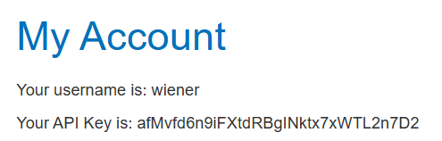
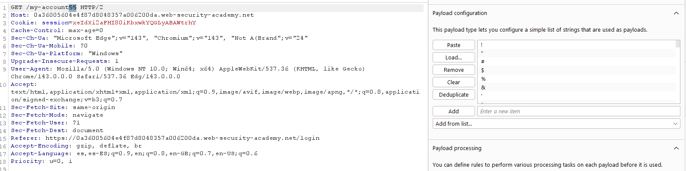
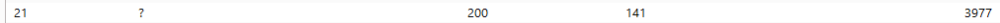
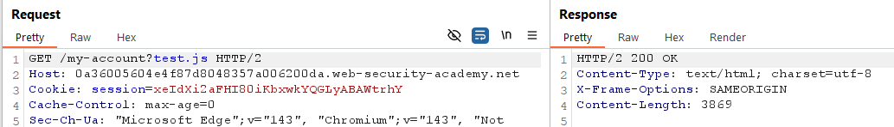
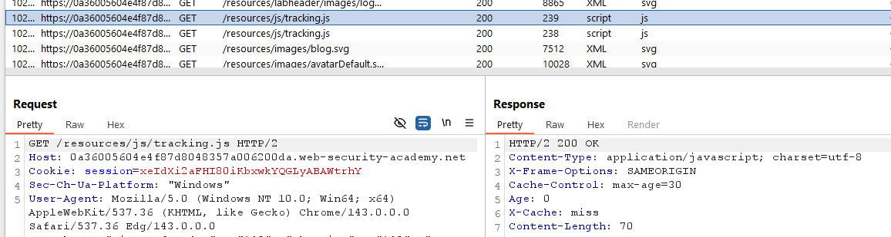
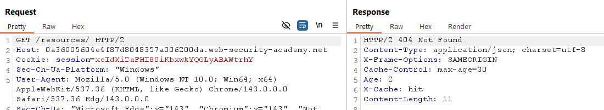
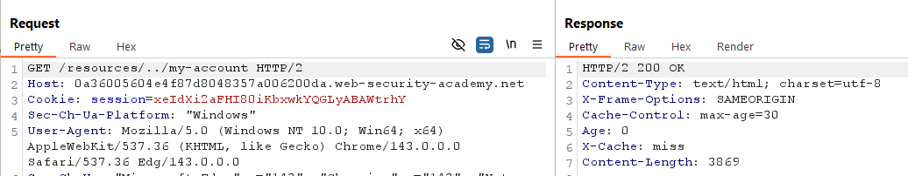
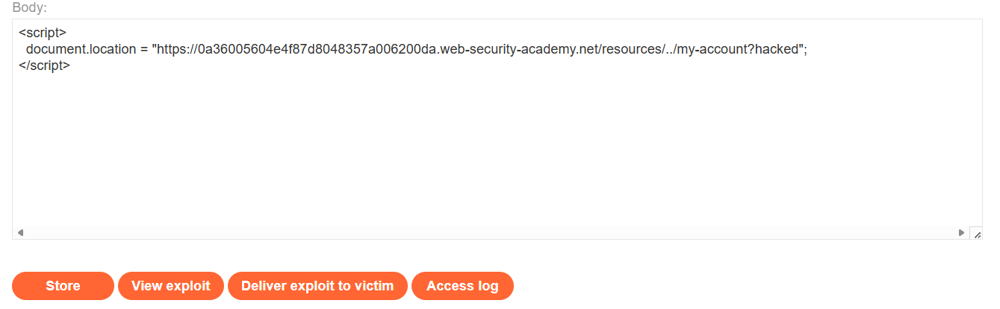
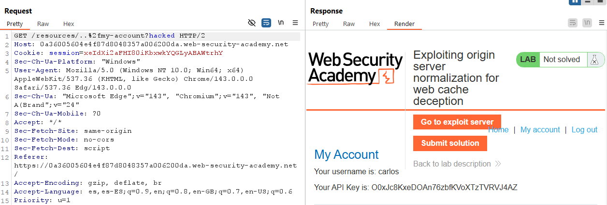
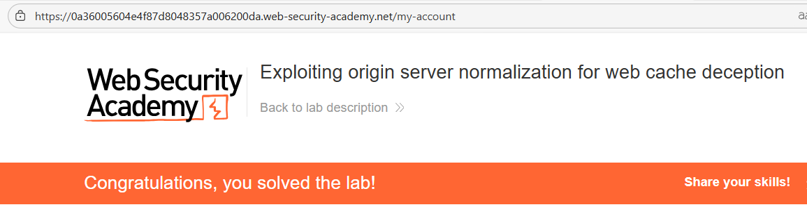

# 🌐 Web Cache Deception mediante normalización en el servidor origen

## 📄 Descripción del laboratorio

La página:

```
/my-account
```

muestra la **API key del usuario autenticado**.

El sistema utiliza un **caché frontal** que almacena agresivamente respuestas cuya ruta comienza con:

```
/resources/
```

Este prefijo se considera contenido estático (JavaScript, CSS, imágenes, etc.).

La vulnerabilidad aparece por una discrepancia entre:

* El **servidor de origen**, que decodifica y normaliza rutas con path traversal codificado.
* El **sistema de caché**, que no decodifica ni normaliza esas secuencias y aplica reglas de cacheo basadas solo en el prefijo del path.

El objetivo del laboratorio es:

* Construir una URL que parezca **contenido estático para la caché**
* Forzar al backend a devolver la página **/my-account de Carlos**
* Conseguir que la caché almacene esa respuesta
* Recuperar la **API key de Carlos** desde la caché

Credenciales proporcionadas:

```
wiener:peter
```

 

## 📚 Teoría

Este ataque combina **Web Cache Deception** con **path traversal codificado** y diferencias en la normalización de rutas.

### 📌 Discrepancia crítica

El **backend**:

* Decodifica secuencias como:

```
..%2f
```

* Las interpreta como:

```
../
```

* Normaliza la ruta y resuelve:

```
/resources/..%2fmy-account → /my-account
```

Como resultado, devuelve **contenido dinámico personalizado** (la API key del usuario autenticado).

La **caché frontal**:

* No decodifica `..%2f`
* Interpreta la ruta literalmente como:

```
/resources/..%2fmy-account
```

Al comenzar por `/resources/`, aplica **reglas de cacheo estático**.

### 📌 Resultado del engaño

Cuando una víctima autenticada visita la URL manipulada:

1. El backend devuelve su página real `/my-account`.
2. La respuesta contiene **su API key**.
3. La caché almacena la respuesta como si fuera contenido estático.
4. El atacante puede acceder posteriormente a esa URL y recuperar la respuesta cacheada.

Esta variante es más sofisticada porque explota:

* **Normalización distinta entre backend y caché**
* **Decodificación inconsistente**
* **Reglas de caché basadas en prefijos de ruta**

 

## 📝 Práctica

### 1️⃣ Análisis inicial

Iniciamos sesión con las credenciales:

```
wiener:peter
```

Accedemos a:

```
/my-account
```

Observamos que la página muestra **nuestra API key**.


 

### 2️⃣ Pruebas iniciales sobre /my-account

Interceptamos la petición:

```http
GET /my-account
```

y la enviamos a **Burp Repeater**.

Probamos distintas variantes de la ruta.

<br>

Observamos que la aplicación sigue respondiendo correctamente cuando añadimos ciertos caracteres como:

```
/my-account?test
```

<br>

Sin embargo, rutas como:

```
/my-account?test.js
```

no activan el sistema de caché.

Esto indica que la caché **no se basa en extensiones en este caso**.


 

### 3️⃣ Identificación del prefijo cacheado

Revisando el **HTTP history**, observamos que las peticiones a:

```
/resources/tracking.js
```

incluyen cabeceras como:

```http
X-Cache: HIT
Age
```

<br>

Probamos también:

```http
GET /resources/
```

<br>

Observamos que la respuesta **también se cachea**.

Esto indica que el prefijo:

```
/resources/
```

activa reglas de **cacheo para contenido estático**.

 

### 4️⃣ Combinar con path traversal

Probamos a aprovechar el prefijo cacheado con un traversal:

```
/resources/../my-account
```

<br>

El resultado es que:

* El backend normaliza `../`
* Devuelve la página real:

```
/my-account
```

* La caché entra en juego porque la ruta comienza con `/resources/`

Esto demuestra que **contenido dinámico sensible puede cachearse**.

Para evitar colisiones de caché, añadimos un parámetro único:

```
/resources/../my-account?hacked
```

 

### 5️⃣ Explotación inicial contra Carlos

Creamos un exploit en el **Exploit Server** que redirija automáticamente a la víctima.

```html
<script>
document.location = "https://ID-LAB.web-security-academy.net/resources/../my-account?hacked";
</script>
```

Guardamos el exploit con **Store** y ejecutamos **Deliver exploit to victim**.

<br>

Al intentar acceder posteriormente a la URL, observamos que la caché devuelve **nuestra propia respuesta**, lo que indica que el backend está aplicando normalización adicional.

 

### 6️⃣ Bypass mediante traversal codificado

Para forzar la discrepancia entre caché y backend, codificamos el `/` del traversal.

La nueva ruta es:

```
/resources/..%2fmy-account?hacked
```

Actualizamos el exploit:

```html
<script>
document.location = "https://ID-LAB.web-security-academy.net/resources/..%2fmy-account?hacked";
</script>
```

Guardamos nuevamente el exploit y ejecutamos **Deliver exploit to victim**.

 

### 7️⃣ Recuperar la respuesta cacheada

Cuando Carlos visita la URL manipulada:

1. El backend decodifica `..%2f` y resuelve la ruta como `/my-account`.
2. Devuelve su página personalizada con la **API key**.
3. La caché almacena la respuesta bajo la ruta manipulada.

Accedemos directamente a:

```
/resources/..%2fmy-account?hacked
```

<br>

La respuesta cacheada pertenece a **Carlos** y contiene su **API key**.

Copiamos la clave y la enviamos como solución.


