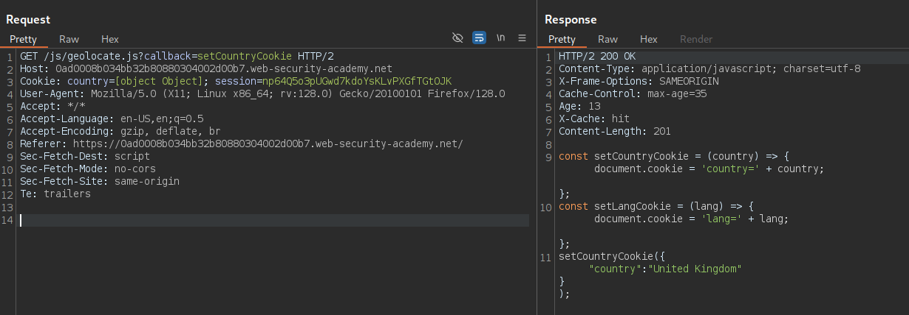
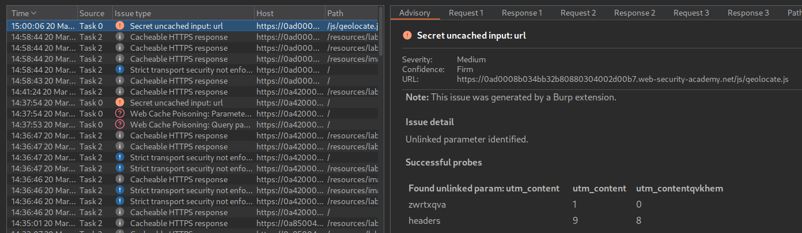
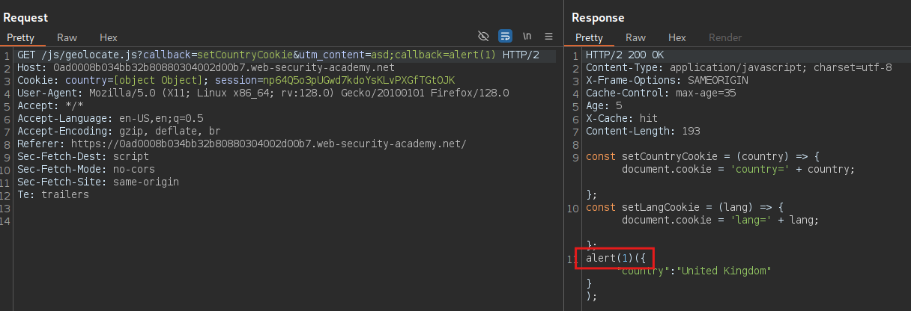

# 🧪 Web Cache Poisoning mediante Parameter Cloaking

## 📄 Descripción del laboratorio

Este laboratorio es vulnerable a **Web Cache Poisoning** debido a dos problemas combinados:

* Un parámetro de la URL no se incluye en la **cache key**.
* Existe una **inconsistencia en cómo la caché y el backend interpretan los parámetros**.

La aplicación carga un recurso JavaScript que acepta parámetros desde la URL. Debido a esta discrepancia en el análisis de parámetros, es posible manipular el comportamiento del backend sin que la caché genere una nueva entrada.

Un usuario víctima visita regularmente la página de inicio del sitio utilizando **Chrome**.

El objetivo del laboratorio es **utilizar la técnica de parameter cloaking para envenenar la caché con una respuesta que ejecute `alert(1)` en el navegador de la víctima**.


## 📚 Teoría

En este laboratorio exploramos **parameter cloaking**, una técnica avanzada de **Web Cache Poisoning** que se basa en una discrepancia entre:

* Cómo la **caché interpreta los parámetros de la URL**.
* Cómo el **backend los procesa realmente**.

### 📌 Parámetro ignorado por la caché

El parámetro clave en este caso es:

```
utm_content
```

Este parámetro presenta el siguiente comportamiento:

* El **backend lo interpreta y lo procesa**.
* La **caché lo ignora al construir la clave de caché**.

Esto significa que modificar su valor **no genera una nueva entrada en caché**, aunque sí influya en la respuesta generada por el servidor.

### 📌 Recurso JavaScript vulnerable

La aplicación carga el recurso:

```
/js/geolocate.js
```

Este archivo acepta un parámetro:

```
callback
```

El valor de `callback` determina **qué función se ejecutará en el navegador**.

Normalmente:

* `callback` **sí forma parte de la cache key**.
* Cambiar su valor genera **una nueva entrada en caché**.

### 📌 Cómo funciona el Parameter Cloaking

El ataque consiste en **ocultar un segundo parámetro dentro de otro parámetro que la caché ignora**.

El backend interpreta parámetros separados por **`;`**, mientras que la caché no los procesa de la misma forma.

Esto permite incluir un **segundo parámetro `callback` dentro de `utm_content`**.

Como resultado:

* El backend procesa el nuevo valor de `callback`.
* La caché sigue creyendo que la clave es la misma.

De esta forma podemos **envenenar el recurso JavaScript compartido** con una llamada arbitraria como `alert(1)`, que se ejecutará para cualquier usuario que cargue ese archivo mientras dure la caché.


## 📝 Práctica

### 1️⃣ Analizar el recurso JavaScript

Analizamos las peticiones realizadas por la página y observamos que se solicita el archivo:

```
/js/geolocate.js
```


<br>

Interceptamos una de estas peticiones y la enviamos a **Burp Repeater** para analizarla.


### 2️⃣ Identificar parámetros ignorados por la caché

Utilizamos **Param Miner** para descubrir parámetros que no formen parte de la cache key.

Tras ejecutar el análisis encontramos el parámetro:

```
utm_content
```

Este parámetro:

* No afecta a la clave de caché.
* Sigue siendo interpretado por el backend.




### 3️⃣ Confirmar el comportamiento de la caché

Probamos una petición normal al recurso:

```http
GET /js/geolocate.js?callback=setCountryCookie&utm_content=asd
```


Observamos que:

* La respuesta se almacena en caché.
* La cabecera muestra:

```http
X-Cache: hit
```

Esto confirma que cambiar `utm_content` **no provoca una nueva entrada en caché**.


### 4️⃣ Aplicar Parameter Cloaking

Intentamos ocultar un segundo parámetro `callback` dentro de `utm_content` usando un punto y coma.

Petición utilizada:

```http
GET /js/geolocate.js?callback=setCountryCookie&utm_content=asd;callback=test
```


Observamos que:

* El valor efectivo de `callback` cambia.
* El servidor refleja ese valor en la respuesta.
* La caché continúa utilizando **la misma clave**.

Esto confirma que la técnica de **parameter cloaking funciona**.


### 5️⃣ Inyectar el payload

Sustituimos el valor oculto de `callback` por nuestro payload final.

```http
GET /js/geolocate.js?callback=setCountryCookie&utm_content=asd;callback=alert(1)
```


<br>

La respuesta JavaScript resultante queda **envenenada y almacenada en caché**.


### 6️⃣ Ejecución en la víctima

A partir de ese momento, cualquier usuario que cargue el recurso:

```
/js/geolocate.js
```

recibirá la **versión cacheada manipulada**.

El navegador ejecutará automáticamente:

```hlsl
alert(1)
```

Cuando la víctima visita la página, el laboratorio detecta la ejecución del payload y se completa.


