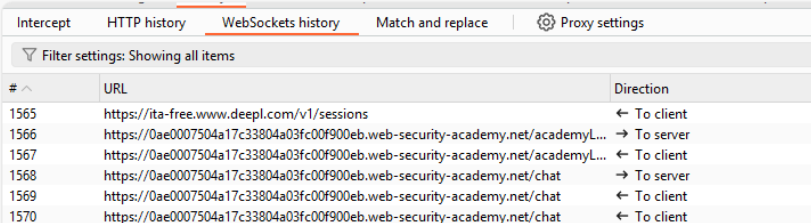
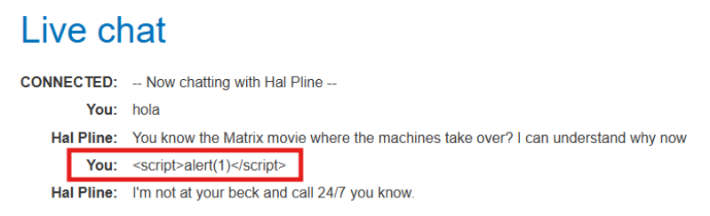
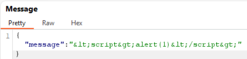
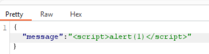
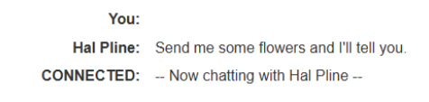
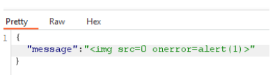
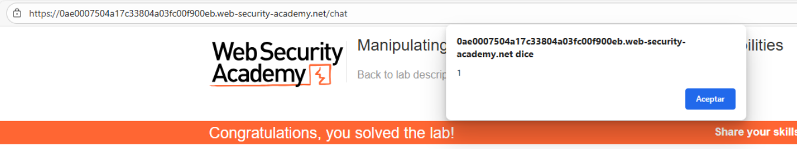

# 📨 Manipulación del handshake y mensajes WebSocket

## 📄 Descripción del laboratorio

La aplicación incluye un **chat en vivo** implementado mediante **WebSockets**.\
Los mensajes enviados por el usuario se muestran en tiempo real en el navegador de un **agente de soporte**.

El objetivo es:

* Manipular un **mensaje WebSocket**.
* Ejecutar **código JavaScript** en el navegador del agente.
* Provocar un `alert()` como prueba de ejecución.

 

## 📚 Teoría

Las comunicaciones **WebSocket** permiten establecer un canal **bidireccional y persistente** entre cliente y servidor.

Una vez completado el **handshake inicial**, los mensajes posteriores:

* No pasan por los filtros clásicos del navegador.
* No aplican automáticamente políticas como **CSP** o sanitización HTML.
* Dependen completamente de las **validaciones implementadas por el servidor**.

En este laboratorio ocurre lo siguiente:

* El **cliente aplica HTML entity encoding** a los mensajes antes de enviarlos.
* Esto evita ataques XSS directos desde el navegador.

Sin embargo, esta protección es **exclusivamente client-side**.

### 📌 Punto clave

Si interceptamos y modificamos el mensaje WebSocket en tránsito (por ejemplo con **Burp Suite**):

* Podemos eliminar el **encoding aplicado por el cliente**.
* Enviar **HTML o JavaScript en texto plano**.
* El servidor **reenvía el mensaje sin sanitizar**.
* El navegador del agente lo **renderiza y ejecuta**.

Esto resulta en un **XSS reflejado vía WebSocket**.

Este laboratorio demuestra por qué **nunca se debe confiar en validaciones del lado cliente**.\
Toda sanitización debe realizarse **en el servidor**, incluso en canales WebSocket.

 

## 📝 Práctica

### 🎯 Objetivo

Provocar un `alert()` en el navegador del agente de soporte.

 

### 1️⃣ Observación del tráfico WebSocket

Abrimos la funcionalidad de **live chat** de la aplicación.

En **Burp Suite**, accedemos a:

**WebSockets history**

Desde ahí podemos observar los mensajes enviados y recibidos en tiempo real.



 

### 2️⃣ Prueba de XSS directa desde el cliente

Intentamos enviar un payload XSS clásico desde el chat:

```html
<script>alert(1)</script>
```

<br>

Resultado:

El mensaje aparece **codificado**.\
Los caracteres `<` y `>` se convierten en **entidades HTML**.

<br>

Esto confirma que el **cliente aplica encoding antes de enviar el mensaje**.

 

### 3️⃣ Bypass del encoding del cliente

Interceptamos el mensaje WebSocket y lo enviamos al **Repeater**.

Eliminamos manualmente el encoding y enviamos el payload sin modificar:

```html
<script>alert(1)</script>
```

<br>

<br>

Resultado:

El agente no ejecuta el script.\
Esto sugiere que el servidor probablemente **filtra explícitamente la etiqueta `<script>`**.

 

### 4️⃣ Uso de un payload alternativo

Probamos un payload que no depende de la etiqueta `<script>`:

```html

```

Enviamos el mensaje **sin codificar** desde el Repeater.

<br>

Resultado:

* El agente recibe el mensaje.
* El navegador intenta cargar una imagen inválida.
* Se dispara el evento `onerror`.
* Aparece el `alert(1)`.


 

### 5️⃣ Resultado final

El servidor reenvía los mensajes WebSocket **sin aplicar sanitización**.

El navegador del agente renderiza el contenido recibido, lo que permite ejecutar **JavaScript arbitrario**.

Se confirma una vulnerabilidad de **XSS a través de WebSockets**.

El laboratorio se resuelve correctamente.
